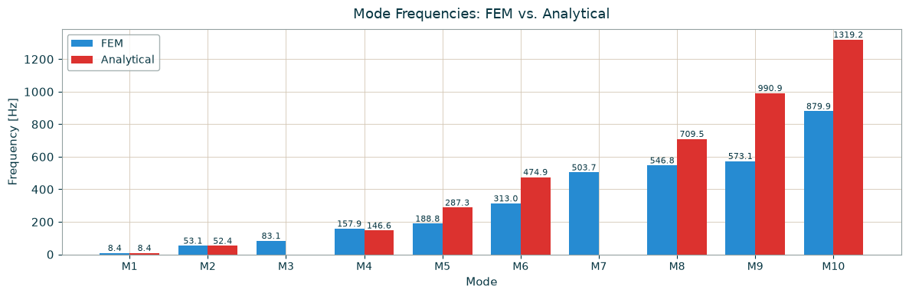
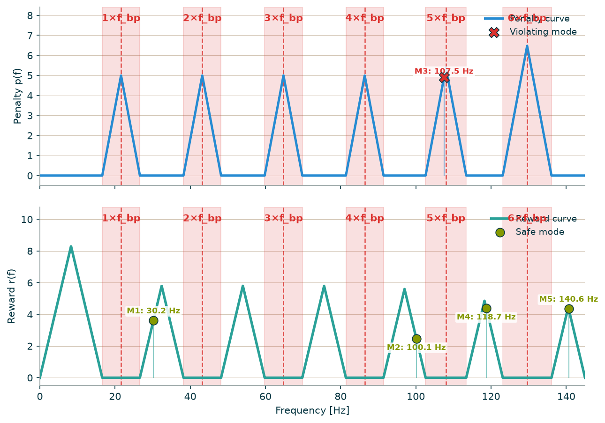
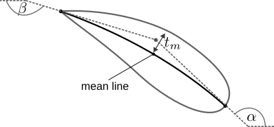
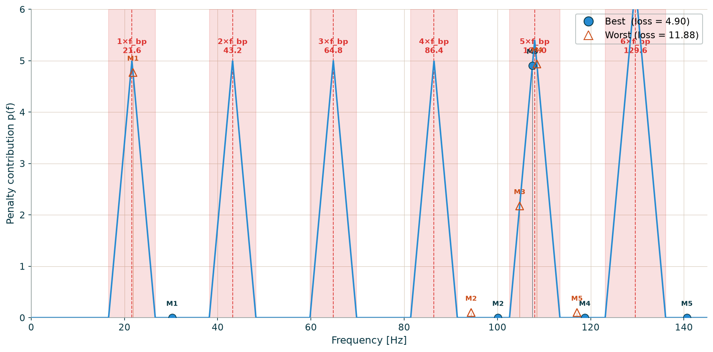

# Introduction

## Motivation

Turbine design: optimize all three at once — not one discipline at a time.

```{=html}
<figure class="motiv-cycle" style="margin:0.2em 0 0.4em;text-align:center;">
<svg viewBox="0 0 920 660" role="img" aria-label="Traditional turbine-design loop: design, CFD, stresses and frequencies handed sequentially between fluid and structural mechanics; a coupled optimizer drives all three objectives at once." style="width:100%;max-width:1050px;height:auto;overflow:visible;font-family:'IBM Plex Mono',monospace;">
<defs>
<marker id="a-g" viewBox="0 0 10 10" refX="8" refY="5" markerWidth="7" markerHeight="7" orient="auto-start-reverse"><path d="M0,0 L10,5 L0,10 z" fill="#9a9490"/></marker>
<marker id="a-b" viewBox="0 0 10 10" refX="8" refY="5" markerWidth="7" markerHeight="7" orient="auto-start-reverse"><path d="M0,0 L10,5 L0,10 z" fill="#0088b0"/></marker>
<marker id="a-m" viewBox="0 0 10 10" refX="8" refY="5" markerWidth="7" markerHeight="7" orient="auto-start-reverse"><path d="M0,0 L10,5 L0,10 z" fill="#d6006c"/></marker>
<marker id="a-y" viewBox="0 0 10 10" refX="8" refY="5" markerWidth="7" markerHeight="7" orient="auto-start-reverse"><path d="M0,0 L10,5 L0,10 z" fill="#edbb00"/></marker>
</defs>
<path d="M 525.6 137.7 A 175 175 0 0 1 622.3 234.4" fill="none" stroke="#9a9490" stroke-width="2.5" stroke-dasharray="6 6" marker-end="url(#a-g)"/>
<path d="M 622.3 365.6 A 175 175 0 0 1 525.6 462.3" fill="none" stroke="#9a9490" stroke-width="2.5" stroke-dasharray="6 6" marker-end="url(#a-g)"/>
<path d="M 394.4 462.3 A 175 175 0 0 1 297.7 365.6" fill="none" stroke="#9a9490" stroke-width="2.5" stroke-dasharray="6 6" marker-end="url(#a-g)"/>
<path d="M 297.7 234.4 A 175 175 0 0 1 394.4 137.7" fill="none" stroke="#9a9490" stroke-width="2.5" stroke-dasharray="6 6" marker-end="url(#a-g)"/>
<line x1="521.0" y1="300.0" x2="602.0" y2="300.0" stroke="#0088b0" stroke-width="3" marker-end="url(#a-b)"/>
<line x1="460.0" y1="361.0" x2="460.0" y2="442.0" stroke="#d6006c" stroke-width="3" marker-end="url(#a-m)"/>
<line x1="399.0" y1="300.0" x2="318.0" y2="300.0" stroke="#edbb00" stroke-width="3" marker-end="url(#a-y)"/>
<circle cx="460.0" cy="125.0" r="27" fill="#f3f2f2" stroke="#8a8580" stroke-width="3"/>
<text x="460.0" y="82.0" text-anchor="middle" style="fill:#201e1d;font-size:23px;font-weight:600;">Design</text>
<circle cx="635.0" cy="300.0" r="27" fill="#0088b0" stroke="#f3f2f2" stroke-width="3"/>
<text x="678.0" y="306.0" text-anchor="start" style="fill:#201e1d;font-size:23px;font-weight:600;">CFD</text>
<circle cx="460.0" cy="475.0" r="27" fill="#d6006c" stroke="#f3f2f2" stroke-width="3"/>
<text x="460.0" y="536.0" text-anchor="middle" style="fill:#201e1d;font-size:23px;font-weight:600;">Stresses</text>
<circle cx="285.0" cy="300.0" r="27" fill="#edbb00" stroke="#f3f2f2" stroke-width="3"/>
<text x="242.0" y="306.0" text-anchor="end" style="fill:#201e1d;font-size:23px;font-weight:600;">Frequencies</text>
<circle cx="460" cy="300" r="58" fill="#201e1d"/>
<text x="460" y="294" text-anchor="middle" style="fill:#fff;font-size:19px;font-weight:600;">coupled</text>
<text x="460" y="318" text-anchor="middle" style="fill:#fff;font-size:19px;font-weight:600;">optimizer</text>
</svg>
</figure>
```

::: {.notes}
Turbine design in industry is siloed: the fluid-mechanics group runs the CFD, hands the geometry to the structural group, who compute stresses and eigenfrequencies, then send corrections back — one discipline at a time, many slow iterations. My goal is a coupled optimizer that drives all three objectives — hydraulic performance, stresses and eigenfrequencies — simultaneously.
:::


## Project context & goal

- Stuttgart–Laval exchange within DFG Priority Programme  
  - SPP 2335: Daring More Intelligence – Design Assistants in Mechanics and Dynamics
  - Project: Shape Optimizations Using AI Agents to Accelerate Numerical Flow Field Simulation and to Control the Island Model for Massive Parallelization
- Goal: **open-source structural modal-analysis framework**
  - independent usable
  - frequency-aware optimization
- **dtOO** — shape-optimizer for hydraulic machines
  - efficiency $\eta$, cavitation volume $V_{cav}$, design head $\Delta H$
- This project adds a structural **eigenfrequency objective** — avoid runner resonance under blade-passing excitation.
- Scope: CFD-only, modal-only, combined — validated on Laval Francis-runner reference data.

::: {.notes}
This is the final report of my three-month Stuttgart–Laval exchange within DFG Priority Programme SPP 2335. The overarching programme theme: AI-driven shape optimisation and island-model parallelisation for hydraulic machines.

My specific contribution: dtOO — our in-house shape optimiser for hydraulic turbines — previously only optimised hydraulic objectives: efficiency, cavitation volume, design head. I add a structural objective: eigenfrequencies of the runner. The goal is a standalone, pip-installable open-source package that is independently usable and cleanly coupled to dtOO for testing.
:::


## Project roadmap

```{=html}
<figure class="roadmap-timeline" style="margin:0.2em 0 0.9em;">
  <svg viewBox="0 0 1632 92" role="img"
       aria-label="Three-step roadmap; step one, modal in vacuum, is current"
       style="width:100%;height:auto;overflow:visible;">
    <line x1="0" y1="26" x2="1632" y2="26" stroke="#201e1d" stroke-width="2" opacity="0.30"></line>
    <circle cx="272"  cy="26" r="13" fill="#0088b0"></circle>
    <circle cx="816"  cy="26" r="13" fill="#6b6663"></circle>
    <circle cx="1360" cy="26" r="13" fill="#6b6663"></circle>
    <text x="272" y="80" text-anchor="middle"
          style="fill:#0088b0;letter-spacing:0.12em;font-family:'IBM Plex Mono',monospace;font-size:24px;">▲ WE ARE HERE</text>
  </svg>
</figure>
```

::: {.columns}
::: {.column width="33%"}
### 01 · Modal in vacuum
- Testcase Beam 
- Runner: Dry eigenfrequencies
  - Validated vs Experiment + reference solvers.
- Dry modes coupled into the optimizer cost function.
:::
::: {.column width="33%"}
### 02 · Fluid–structure interaction
- Linear elasticity + Helmholtz acoustics + coupling.
- Wet added-mass + pre-stress enter the modal solve.
:::
::: {.column width="33%"}
### 03 · Data-driven surrogate
- Surrogate model + transfer learning.
- Accelerate the coupled optimization.
:::
:::

::: {.notes}
The roadmap has three stages. We are at the end of Stage 1: dry modal analysis. Solver validated, objective function implemented, optimiser running on the cluster. Stage 2 — fluid–structure interaction with added mass — and Stage 3 — data-driven surrogates — are the next projects.
:::


# Beam Testcase

## Beam Testcase — Theory {.smaller}

::: {.columns}
::: {.column width="50%"}
**Analytical — Euler–Bernoulli** free bending vibration:

$$EI\,\frac{\partial^4 w}{\partial x^4} + \rho A\,\frac{\partial^2 w}{\partial t^2} = 0$$


Cantilever BC (clamped $x{=}0$, free $x{=}L$) ⇒ **characteristic equation** ($\alpha\equiv\beta L$):

$$\cos\alpha\,\cosh\alpha = -1 \;\Rightarrow\; \alpha_1{\approx}1.875,\ \alpha_2{\approx}4.694,\ \alpha_3{\approx}7.855$$

**From $\alpha$ to frequency** — dimensionless roots, exact:

$$f_n = \frac{1}{2\pi}\left(\frac{\alpha_n}{L}\right)^2\sqrt{\frac{EI}{\rho A}}$$

Scales with $\alpha_n^2$ — modes rise fast ($f_2/f_1\approx6.3$).
:::
::: {.column width="50%"}
**Numerical — 3D FEM**: elasticity weak form discretized into a generalized eigenvalue problem:

$$K\,\phi = \omega^2 M\,\phi$$

- **FEniCSx** (DOLFINx) — weak form, mesh, assemble $K$ (stiffness) + $M$ (mass).
- **SLEPc** on PETSc — Krylov–Schur + **shift-invert** for lowest modes; LU / MUMPS.
- **P2** quadratic tets (10-node) — far more accurate in bending than P1 (over-stiff) per DOF.
:::
:::

::: {.notes}
Two ways to the same frequencies. Left, the analytical reference: the Euler–Bernoulli beam has an exact closed-form solution. Separation of variables reduces the PDE to a 4th-order ODE; the cantilever boundary conditions (clamped at x=0, free at x=L) make the determinant vanish only when cos(α)·cosh(α) = −1. The roots α are dimensionless — they encode only mode shape and boundary condition; actual frequencies follow by inserting material (E, ρ) and geometry (I, A, L). Because f scales with α², higher modes rise quickly. Right, the numerical method for real geometry: the continuous 3D elasticity eigenvalue problem is discretized by finite elements into Kφ = ω²Mφ — K stiffness, M mass. FEniCSx handles weak form, meshing and assembly; SLEPc (on PETSc) extracts the lowest eigenpairs via Krylov–Schur with a shift-invert spectral transformation, inner solves by direct LU (MUMPS). Element choice matters: P1 linear tets over-stiffen bending; P2 quadratic tets (edge-midpoint nodes, 10 per tet) give far higher accuracy per DOF — so we use P2.
:::


## Beam validation — Results, Analytical vs Numerical Solution

::: {.columns}
::: {.column width="55%"}
- 3D bending modes reproduce the analytical frequencies within engineering tolerance — e.g. Mode 1: **8.4 Hz** (FEM) vs **8.4 Hz** (analytical).
- Higher modes deviate slightly (3D/shear vs slender-beam theory).
- 3D also captures **torsion** modes the 1D model lacks.
- **Validation passed** — solver trustworthy for the real 3D runner.
:::
::: {.column width="45%"}
```{=html}
<iframe src="embeds/beam_modal_showcase_top.html" style="width:100%;height:280px;border:0;"></iframe>
```


:::
:::

::: {.notes}
Now the results. FEniCSx solves the full 3D generalized eigenvalue problem Kφ = ω²Mφ on the meshed beam — not the 1D beam equation. The 3D bending modes reproduce the analytical Euler–Bernoulli frequencies to engineering accuracy; Mode 1 matches at 8.4 Hz. Higher modes deviate slightly because Euler–Bernoulli is a slender-beam approximation (no shear/3D effects), and the 3D solve additionally reveals torsion modes the 1D model cannot represent. The interactive viewer on the right lets you step through the mode shapes. Validation passed — the solver is trustworthy for the real 3D runner.
:::


# 3D Testcase 

## 3D validation {.smaller}

::: {.columns}
::: {.column width="55%"}
**PASSED · ALL MEASURED MODES WITHIN 5%**

- Testcase — bronze disc, hammer-impact experiment:
  - free–free BC · 6 rigid-body modes discarded
  - d = 0.2 m · h = 87 mm · m ≈ 5.99 kg
  - E = 75.85 GPa · ρ = 8910 kg/m³ · ν = 0.34
- Mesh — 325k tet10, P2 → **1.96 M vector DOFs**.
- Solver — FEniCSx + SLEPc (GHEP, shift-invert, LU/MUMPS).
:::
::: {.column width="45%"}
```{=html}
<iframe src="embeds/testcase_mesh.html" style="width:100%;height:400px;border:0;"></iframe>
```
Validation Geometry
:::
:::

::: {.notes}
Stronger validation than the beam: here I compare against real hammer-impact measurements of a bronze disc, provided by the Laval group. Free-free boundary conditions, 6 rigid-body modes discarded. 325,000 quadratic tetrahedra (P2, tet10), yielding ~1.96 million DOFs. All measured modes within 5% — the solver is trustworthy for real 3D geometries.
:::

## Measured modes & the case for P2 {.smaller}

::: {.columns}
::: {.column width="60%"}
FEniCSx vs. experiment vs. ANSYS

| Mode | FEniCSx (Hz) | Experiment | Δexp | ANSYS | ΔANSYS |
|---|---|---|---|---|---|
| 1ND | 192.45 | 192.8 | −0.18% | 191.6 | +0.44% |
| Tors. | 223.73 | — | n.m. | 226.0 | −1.01% |
| 2ND | 290.16 | 299.13 | −3.00% | 293.63 | −1.18% |
| 3ND | 693.92 | 712.0 | −2.54% | 703.25 | −1.33% |
| 4ND | 1291.50 | 1320.0 | −2.16% | 1310.88 | −1.48% |

All Δexp ≤ 3%, all ΔANSYS ≤ 1.5%. ND modes = degenerate sin/cos pairs (split < 0.1 Hz → symmetry preserved); torsion is a singlet, not measured.
:::
::: {.column width="40%"}
Mesh order — P1 vs P2

| Mode | P1 tet4 | P2 tet10 |
|---|---|---|
| 1ND | +19.95% | −0.18% |
| 2ND | +19.16% | −3.00% |
| 3ND | +20.06% | −2.54% |
| 4ND | +14.43% | −2.16% |

Linear tet4 over-stiffens bending modes; quadratic tet10 removes the bias — hence P2 + SLEPc/MUMPS at ~2M DOFs.
:::
:::

::: {.notes}
The table shows: FEniCSx hits all experimental modes within 3%, ANSYS within 1.5%. The key point is the right-hand table: linear tetrahedra (P1/tet4) over-stiffen bending modes by 14–20% — this makes them unusable for modal analysis. Quadratic tetrahedra (P2/tet10) eliminate this systematic bias. That justifies choosing P2 at ~2M DOFs despite the higher computational cost.
:::

# Eigenfrequency-Aware Optimization

## Blade-Passing Frequency 

::: {.columns}
::: {.column width="50%"}
### Excitation & resonance

- Runner excited by guide-vane blade-passing frequency $f_{bp}=Z\,n/60$.
  - kinematic — fixed by vane count Z + speed n
  - no CFD required
- Resonance = eigenfrequency inside an excitation band.
- Optimizer must keep modal frequencies out of forbidden bands, alongside hydraulic objectives.
:::
::: {.column width="50%"}

```{=html}
<iframe src="embeds/geometry_worst_cyl_rotating.html" style="width:100%;height:520px;border:0;background:transparent;"></iframe>
```

:::
:::

::: {.notes}
Why does this matter? The excitation frequency of a runner is kinematically fixed: guide-vane count Z times rotational speed n divided by 60. For the Tistos runner: Z=18, n=90 RPM → f_bp ≈ 27 Hz — plus its harmonics. If an eigenfrequency falls inside one of these bands, resonance occurs — structural damage, fatigue, potentially failure.

The fluid plays an important role: still water increases the effective mass of the runner, lowering wet-mode eigenfrequencies by 20–40% compared to dry in-air measurements. In this exchange we work with dry modes — that is the foundation. Coupling with the fluid is the next step.
:::


## Objective function {.smaller}

::: {.columns}
::: {.column width="55%"}
Total loss: $$f_{\text{total}}=f_{\text{CFD}}+f_{\text{res}}$$

Penalty: $$p(f)=\sum_{h=1}^{4}k\min(f-D_{h,\text{lo}},\,D_{h,\text{hi}}-f)\ \text{if}\ f\in D_h,\ \text{else}\ 0$$

Reward: $$r(f)=\sum_{j=1}^{J}k\min(f-G_{j,\text{lo}},\,G_{j,\text{hi}}-f)\ \text{if}\ f\in G_j,\ \text{else}\ 0$$

CFD loss: $$f_{\text{CFD}}=w_\eta\tanh|1-\eta|+w_{\text{cav}}\tanh\!\left(V_{\text{cav}}\,10^{6}\right)+w_{\text{head}}\tanh|dH-dH_{\text{t}}|$$
:::
::: {.column width="45%"}

:::
:::

::: {.notes}
The objective has two terms. The CFD term (f_CFD) combines efficiency, cavitation, and head deviation with tanh-damping — keeping outliers bounded. The resonance term (f_res) is a penalty-reward function evaluated over the eigenfrequencies.

Penalty: if an eigenfrequency falls inside a forbidden band D_h — near the blade-passing frequency or a harmonic — the penalty rises linearly from the band edges to a peak at the band centre. Triangle shape.

Reward: mirror image in the safe gaps between bands. The optimiser is actively rewarded for pushing frequencies towards the centre of a gap, not just barely outside a band. This prevents unstable boundary solutions that hover near the edge of a forbidden zone.
:::


## Geometry parameterization

::: {.columns}
::: {.column width="45%"}
- **30 continuous shape variables** at three spanwise sections (hub, mid-span, tip).
- Control **flow angles**, **chord length**, **thickness** and **position** in the passage.
- dtOO exports **geometry only** → `runner.msh` (OpenCascade + GMSH) — no CFD mesh.
- **Mid-span shape** + **outlet angle** dominate the resonance response.
:::
::: {.column width="55%"}
{height="170"}

```{=html}
<iframe src="embeds/geometry_worst_blade_slide.html" style="width:100%;height:400px;border:0;"></iframe>
```
:::
:::

::: {.notes}
dtOO parameterises the runner blade with 30 continuous variables, each resolved at three spanwise sections (hub, mid-span, tip). They set the inlet and outlet flow angles, the blade length, the thickness distribution from leading to trailing edge, and the blade's meridional and circumferential position in the passage.

Important: I export only the geometry mesh for the modal solver — no CFD mesh here. dtOO writes runner.msh directly via OpenCascade and GMSH. The mid-span shape and the outlet (trailing-edge) angle dominate the resonance response — quantified on the sensitivity slide.
:::

## Parameter sensitivity

::: {.columns}
::: {.column width="50%"}
Spearman ρ vs. f_resonance (31 valid individuals)

| Rank | Label | ρ |
|---|---|---|
| 1 | α₂_ex_1.0 | −0.732 |
| 2 | offsetM_ex_0.5 | +0.723 |
| 3 | t_mid_a_0.5 | −0.715 |
| 4 | offsetΦ_R_ex_0.5 | −0.625 |
| 5 | offsetM_ex_1.0 | −0.624 |
| 6 | bladeLength_0.5 | −0.575 |
:::
::: {.column width="50%"}

:::
:::

::: {.notes}
From the first 31 valid DE individuals, a sensitivity analysis can already be derived. Spearman rank correlation between each parameter and the resonance penalty shows: α₂ at the tip (trailing-edge outer), offsetM mid, and t_mid mid dominate with |ρ| > 0.7. These are the critical design levers for resonance avoidance — and explain why the optimiser heavily varies exactly these parameters in later generations.
:::

## Best vs. worst blade shape {.smaller}

Optimizer spread — the individuals with the **lowest** and **highest** resonance objective.

::: {.columns}
::: {.column width="50%"}
**Best** — resonance objective 4.90

```{=html}
<iframe src="embeds/geometry_best_blade_slide.html" style="width:100%;height:400px;border:0;"></iframe>
```
:::
::: {.column width="50%"}
**Worst** — resonance objective 11.88

```{=html}
<iframe src="embeds/geometry_worst_blade_slide.html" style="width:100%;height:400px;border:0;"></iframe>
```
:::
:::

::: {.notes}
The two extremes of the population make the effect tangible. The best individual (resonance objective 4.90) keeps all eigenfrequencies clear of the blade-passing bands; the worst (11.88) sits deep inside a forbidden band. Comparing the shapes side by side shows how the optimiser reshapes mainly the mid-span and the trailing edge — exactly the parameters the sensitivity analysis flagged.
:::


# Optimization, Parallelization, Tooling

## Differential Evolution {.smaller}

Population-based evolutionary search — mutation, crossover and greedy selection each generation.

::: {.columns}
::: {.column width="56%"}
```{=html}
<figure style="margin:0.2em 0 0;text-align:center;">
<svg viewBox="0 0 640 640" role="img" aria-label="Differential Evolution per generation: from the population, mutation builds a donor from three random members, crossover forms a trial, greedy selection keeps the better vector; repeat next generation." style="width:100%;max-width:500px;height:auto;overflow:visible;font-family:'IBM Plex Mono',monospace;">
<defs>
<marker id="dn2" viewBox="0 0 10 10" refX="8" refY="5" markerWidth="7" markerHeight="7" orient="auto-start-reverse"><path d="M0,0 L10,5 L0,10 z" fill="#201e1d"/></marker>
<marker id="rt2" viewBox="0 0 10 10" refX="8" refY="5" markerWidth="8" markerHeight="8" orient="auto-start-reverse"><path d="M0,0 L10,5 L0,10 z" fill="#d6006c"/></marker>
</defs>
<text x="330" y="30" text-anchor="middle" style="fill:#6b6663;font-size:19px;letter-spacing:0.05em;">differential evolution · per generation</text>
<text x="330" y="64" text-anchor="middle" style="fill:#201e1d;font-size:22px;font-weight:600;">Population — Gen n  (NP = 20)</text>
<circle cx="110" cy="90" r="8" fill="#006786" opacity="0.9"/>
<circle cx="170" cy="90" r="8" fill="#0088b0" opacity="0.9"/>
<circle cx="230" cy="90" r="8" fill="#0088b0" opacity="0.9"/>
<circle cx="290" cy="90" r="9" fill="#d6006c" stroke="#201e1d" stroke-width="2"/>
<circle cx="350" cy="90" r="8" fill="#0088b0" opacity="0.9"/>
<circle cx="410" cy="90" r="8" fill="#38a6cf" opacity="0.9"/>
<circle cx="470" cy="90" r="8" fill="#0088b0" opacity="0.9"/>
<circle cx="530" cy="90" r="8" fill="#edbb00" opacity="0.9"/>
<text x="330" y="120" text-anchor="middle" style="fill:#6b6663;font-size:16px;">◍ target xᵢ   ● three random xᵣ₁,xᵣ₂,xᵣ₃</text>
<line x1="330" y1="132" x2="330" y2="150" stroke="#201e1d" stroke-width="2.5" marker-end="url(#dn2)"/>
<rect x="95" y="150" width="450" height="76" rx="12" fill="#f3f2f2" stroke="#006786" stroke-width="2.5"/>
<text x="330" y="181" text-anchor="middle" style="fill:#201e1d;font-size:24px;font-weight:600;">Mutation</text>
<text x="330" y="208" text-anchor="middle" style="fill:#006786;font-size:19px;">donor  v = xᵣ₁ + F·(xᵣ₂ − xᵣ₃),  F = 0.8</text>
<line x1="330" y1="226" x2="330" y2="246" stroke="#201e1d" stroke-width="2.5" marker-end="url(#dn2)"/>
<rect x="95" y="246" width="450" height="76" rx="12" fill="#f3f2f2" stroke="#0088b0" stroke-width="2.5"/>
<text x="330" y="277" text-anchor="middle" style="fill:#201e1d;font-size:24px;font-weight:600;">Crossover</text>
<text x="330" y="304" text-anchor="middle" style="fill:#0088b0;font-size:19px;">trial  u ← mix(xᵢ, v),  CR = 0.9</text>
<line x1="330" y1="322" x2="330" y2="342" stroke="#201e1d" stroke-width="2.5" marker-end="url(#dn2)"/>
<rect x="95" y="342" width="450" height="76" rx="12" fill="#f3f2f2" stroke="#d6006c" stroke-width="2.5"/>
<text x="330" y="373" text-anchor="middle" style="fill:#201e1d;font-size:24px;font-weight:600;">Selection (greedy)</text>
<text x="330" y="400" text-anchor="middle" style="fill:#d6006c;font-size:19px;">keep argmin f over { xᵢ , u }</text>
<line x1="330" y1="418" x2="330" y2="438" stroke="#201e1d" stroke-width="2.5" marker-end="url(#dn2)"/>
<text x="330" y="462" text-anchor="middle" style="fill:#201e1d;font-size:22px;font-weight:600;">Population — Gen n+1</text>
<circle cx="110" cy="488" r="8" fill="#0088b0"/>
<circle cx="170" cy="488" r="8" fill="#0088b0"/>
<circle cx="230" cy="488" r="8" fill="#0088b0"/>
<circle cx="290" cy="488" r="8" fill="#0088b0"/>
<circle cx="350" cy="488" r="8" fill="#0088b0"/>
<circle cx="410" cy="488" r="8" fill="#0088b0"/>
<circle cx="470" cy="488" r="8" fill="#0088b0"/>
<circle cx="530" cy="488" r="8" fill="#0088b0"/>
<path d="M 95 488 C 30 488, 30 90, 100 90" fill="none" stroke="#d6006c" stroke-width="2.5" stroke-dasharray="6 5" marker-end="url(#rt2)"/>
<text x="26" y="289" text-anchor="middle" transform="rotate(-90 26 289)" style="fill:#d6006c;font-size:18px;letter-spacing:0.04em;">next generation</text>
</svg>
</figure>
```
:::
::: {.column width="44%"}
- **Population** NP = 20 (up to 32 on the cluster).
- **Mutation** — donor from three random members, F = 0.8.
- **Crossover** — trial vector, CR = 0.9.
- **Greedy selection** — keep the trial only if it lowers f_total.
- Budget: ≤ 30 generations · ~600 evaluations.
:::
:::

::: {.notes}
Differential Evolution is the optimizer. For each target vector we build a donor by adding a scaled difference of two random members to a third (F=0.8), cross it with the target (CR=0.9) to form a trial, then keep whichever of target and trial has the lower total objective — greedy selection. Population 20 (up to 32 on the cluster), up to 30 generations, roughly 600 evaluations budget.
:::


## Pyro5 parallelization {.smaller}

Each evaluation is expensive — distribute it across the cluster with persistent RPC workers.

::: {.columns}
::: {.column width="60%"}
```{=html}
<figure style="margin:0.2em 0 0;text-align:center;">
<svg viewBox="0 -34 940 700" role="img" aria-label="Pyro5 distribution: a DE coordinator dispatches design vectors to N persistent workers; each worker runs a CFD and a modal evaluation and returns the combined fitness." style="width:100%;max-width:620px;height:auto;overflow:visible;font-family:'IBM Plex Mono',monospace;">
<defs>
<marker id="disp" viewBox="0 0 10 10" refX="8" refY="5" markerWidth="7" markerHeight="7" orient="auto-start-reverse"><path d="M0,0 L10,5 L0,10 z" fill="#006786"/></marker>
<marker id="res" viewBox="0 0 10 10" refX="8" refY="5" markerWidth="7" markerHeight="7" orient="auto-start-reverse"><path d="M0,0 L10,5 L0,10 z" fill="#6b6663"/></marker>
</defs>
<line x1="479.0" y1="212.0" x2="479.0" y2="139.0" stroke="#006786" stroke-width="2.4" marker-end="url(#disp)"/>
<line x1="461.0" y1="139.0" x2="461.0" y2="212.0" stroke="#6b6663" stroke-width="2" stroke-dasharray="5 5" marker-end="url(#res)"/>
<line x1="556.5" y1="281.4" x2="625.9" y2="258.8" stroke="#006786" stroke-width="2.4" marker-end="url(#disp)"/>
<line x1="620.3" y1="241.7" x2="550.9" y2="264.2" stroke="#6b6663" stroke-width="2" stroke-dasharray="5 5" marker-end="url(#res)"/>
<line x1="514.4" y1="376.5" x2="557.4" y2="435.5" stroke="#006786" stroke-width="2.4" marker-end="url(#disp)"/>
<line x1="571.9" y1="425.0" x2="529.0" y2="365.9" stroke="#6b6663" stroke-width="2" stroke-dasharray="5 5" marker-end="url(#res)"/>
<line x1="411.0" y1="365.9" x2="368.1" y2="425.0" stroke="#006786" stroke-width="2.4" marker-end="url(#disp)"/>
<line x1="382.6" y1="435.5" x2="425.6" y2="376.5" stroke="#6b6663" stroke-width="2" stroke-dasharray="5 5" marker-end="url(#res)"/>
<line x1="389.1" y1="264.2" x2="319.7" y2="241.7" stroke="#006786" stroke-width="2.4" marker-end="url(#disp)"/>
<line x1="314.1" y1="258.8" x2="383.5" y2="281.4" stroke="#6b6663" stroke-width="2" stroke-dasharray="5 5" marker-end="url(#res)"/>
<circle cx="470.0" cy="65.0" r="66" fill="#f3f2f2" stroke="#0088b0" stroke-width="3"/>
<circle cx="448.0" cy="61.0" r="11" fill="#0088b0"/>
<circle cx="492.0" cy="61.0" r="11" fill="#d6006c"/>
<text x="470.0" y="95.0" text-anchor="middle" style="fill:#201e1d;font-size:16px;font-weight:600;">Worker 0</text>
<circle cx="693.5" cy="227.4" r="66" fill="#f3f2f2" stroke="#38a6cf" stroke-width="3"/>
<circle cx="671.5" cy="223.4" r="11" fill="#0088b0"/>
<circle cx="715.5" cy="223.4" r="11" fill="#d6006c"/>
<text x="693.5" y="257.4" text-anchor="middle" style="fill:#201e1d;font-size:16px;font-weight:600;">Worker 1</text>
<circle cx="608.1" cy="490.1" r="66" fill="#f3f2f2" stroke="#d6006c" stroke-width="3"/>
<circle cx="586.1" cy="486.1" r="11" fill="#0088b0"/>
<circle cx="630.1" cy="486.1" r="11" fill="#d6006c"/>
<text x="608.1" y="520.1" text-anchor="middle" style="fill:#201e1d;font-size:16px;font-weight:600;">Worker 2</text>
<circle cx="331.9" cy="490.1" r="66" fill="#f3f2f2" stroke="#edbb00" stroke-width="3"/>
<circle cx="309.9" cy="486.1" r="11" fill="#0088b0"/>
<circle cx="353.9" cy="486.1" r="11" fill="#d6006c"/>
<text x="331.9" y="520.1" text-anchor="middle" style="fill:#201e1d;font-size:16px;font-weight:600;">Worker 3</text>
<circle cx="246.5" cy="227.4" r="66" fill="#f3f2f2" stroke="#006786" stroke-width="3"/>
<circle cx="224.5" cy="223.4" r="11" fill="#0088b0"/>
<circle cx="268.5" cy="223.4" r="11" fill="#d6006c"/>
<text x="246.5" y="257.4" text-anchor="middle" style="fill:#201e1d;font-size:16px;font-weight:600;">Worker 4</text>
<circle cx="470" cy="300" r="82" fill="#201e1d"/>
<text x="470" y="292" text-anchor="middle" style="fill:#fff;font-size:20px;font-weight:600;">DE client</text>
<text x="470" y="318" text-anchor="middle" style="fill:#fff;font-size:18px;">coordinator</text>
<circle cx="120" cy="600" r="9" fill="#0088b0"/><text x="138" y="606" style="fill:#201e1d;font-size:17px;">CFD (simpleFoam)</text>
<circle cx="420" cy="600" r="9" fill="#d6006c"/><text x="438" y="606" style="fill:#201e1d;font-size:17px;">modal (FEniCSx / SLEPc)</text>
<text x="720" y="606" style="fill:#006786;font-size:16px;">→ dispatch xᵢ</text>
<text x="720" y="628" style="fill:#6b6663;font-size:16px;">⇢ return f_total</text>
</svg>
</figure>
```
:::
::: {.column width="40%"}
- One **DE client** + N persistent **workers** (one per srun step).
- Each worker evaluates a design: **CFD** (simpleFoam) + **modal** (FEniCSx / SLEPc) → f_total.
- **File-based URI discovery** on shared /pfs — no name server; survives node failures.
- **Checkpoint / resume** per generation (de_state.json atomic, de_history.jsonl).
:::
:::

::: {.notes}
Each fitness evaluation is a full pipeline run, so we distribute them. One coordinator (the DE client) plus N persistent worker processes, one per srun step. A worker runs the CFD (simpleFoam) and the modal solve (FEniCSx / SLEPc) for a design vector and returns the combined objective f_total. Discovery is file-based: each worker writes its Pyro5 URI to the shared /pfs filesystem, the coordinator reads them and dispatches round-robin — no name server, robust to partial node failures. State is checkpointed every generation (de_state.json written atomically, de_history.jsonl appended), so an interrupted dev-node slot resumes seamlessly.
:::

## Parallelization — island model {.smaller}

Massive-parallelization target: many islands evolve **in parallel**, periodically exchanging elites via **migration**.

::: {.columns}
::: {.column width="58%"}
```{=html}
<figure style="margin:1.6em 0 0;text-align:center;">
<svg viewBox="0 0 720 640" role="img" aria-label="Island model: six island subpopulations arranged in a ring, each holding several individuals; arrows show periodic migration between neighbouring islands." style="width:100%;max-width:660px;height:auto;overflow:visible;font-family:'IBM Plex Mono',monospace;">
<defs>
<marker id="mig" viewBox="0 0 10 10" refX="8" refY="5" markerWidth="7" markerHeight="7" orient="auto-start-reverse"><path d="M0,0 L10,5 L0,10 z" fill="#006786"/></marker>
</defs>
<path d="M 419.9 104.0 A 205 205 0 0 1 499.8 150.1" fill="none" stroke="#006786" stroke-width="2.4" marker-end="url(#mig)"/>
<path d="M 559.7 253.9 A 205 205 0 0 1 559.7 346.1" fill="none" stroke="#006786" stroke-width="2.4" marker-end="url(#mig)"/>
<path d="M 499.8 449.9 A 205 205 0 0 1 419.9 496.0" fill="none" stroke="#006786" stroke-width="2.4" marker-end="url(#mig)"/>
<path d="M 300.1 496.0 A 205 205 0 0 1 220.2 449.9" fill="none" stroke="#006786" stroke-width="2.4" marker-end="url(#mig)"/>
<path d="M 160.3 346.1 A 205 205 0 0 1 160.3 253.9" fill="none" stroke="#006786" stroke-width="2.4" marker-end="url(#mig)"/>
<path d="M 220.2 150.1 A 205 205 0 0 1 300.1 104.0" fill="none" stroke="#006786" stroke-width="2.4" marker-end="url(#mig)"/>
<text x="477.5" y="96.5" text-anchor="middle" style="fill:#006786;font-size:18px;letter-spacing:0.05em;">migration</text>
<circle cx="360.0" cy="95.0" r="60" fill="#f3f2f2" stroke="#0088b0" stroke-width="3"/>
<circle cx="360.0" cy="95.0" r="7" fill="#0088b0" stroke="#201e1d" stroke-width="2"/>
<circle cx="360.0" cy="125.0" r="6" fill="#0088b0" opacity="0.85"/>
<circle cx="331.5" cy="104.3" r="6" fill="#0088b0" opacity="0.85"/>
<circle cx="342.4" cy="70.7" r="6" fill="#0088b0" opacity="0.85"/>
<circle cx="377.6" cy="70.7" r="6" fill="#0088b0" opacity="0.85"/>
<circle cx="388.5" cy="104.3" r="6" fill="#0088b0" opacity="0.85"/>
<text x="360.0" y="22.0" text-anchor="middle" style="fill:#201e1d;font-size:19px;font-weight:600;">Island 0</text>
<circle cx="537.5" cy="197.5" r="60" fill="#f3f2f2" stroke="#38a6cf" stroke-width="3"/>
<circle cx="537.5" cy="197.5" r="7" fill="#38a6cf" stroke="#201e1d" stroke-width="2"/>
<circle cx="537.5" cy="227.5" r="6" fill="#38a6cf" opacity="0.85"/>
<circle cx="509.0" cy="206.8" r="6" fill="#38a6cf" opacity="0.85"/>
<circle cx="519.9" cy="173.2" r="6" fill="#38a6cf" opacity="0.85"/>
<circle cx="555.2" cy="173.2" r="6" fill="#38a6cf" opacity="0.85"/>
<circle cx="566.1" cy="206.8" r="6" fill="#38a6cf" opacity="0.85"/>
<text x="605.1" y="163.5" text-anchor="middle" style="fill:#201e1d;font-size:19px;font-weight:600;">Island 1</text>
<circle cx="537.5" cy="402.5" r="60" fill="#f3f2f2" stroke="#006786" stroke-width="3"/>
<circle cx="537.5" cy="402.5" r="7" fill="#006786" stroke="#201e1d" stroke-width="2"/>
<circle cx="537.5" cy="432.5" r="6" fill="#006786" opacity="0.85"/>
<circle cx="509.0" cy="411.8" r="6" fill="#006786" opacity="0.85"/>
<circle cx="519.9" cy="378.2" r="6" fill="#006786" opacity="0.85"/>
<circle cx="555.2" cy="378.2" r="6" fill="#006786" opacity="0.85"/>
<circle cx="566.1" cy="411.8" r="6" fill="#006786" opacity="0.85"/>
<text x="605.1" y="446.5" text-anchor="middle" style="fill:#201e1d;font-size:19px;font-weight:600;">Island 2</text>
<circle cx="360.0" cy="505.0" r="60" fill="#f3f2f2" stroke="#d6006c" stroke-width="3"/>
<circle cx="360.0" cy="505.0" r="7" fill="#d6006c" stroke="#201e1d" stroke-width="2"/>
<circle cx="360.0" cy="535.0" r="6" fill="#d6006c" opacity="0.85"/>
<circle cx="331.5" cy="514.3" r="6" fill="#d6006c" opacity="0.85"/>
<circle cx="342.4" cy="480.7" r="6" fill="#d6006c" opacity="0.85"/>
<circle cx="377.6" cy="480.7" r="6" fill="#d6006c" opacity="0.85"/>
<circle cx="388.5" cy="514.3" r="6" fill="#d6006c" opacity="0.85"/>
<text x="360.0" y="588.0" text-anchor="middle" style="fill:#201e1d;font-size:19px;font-weight:600;">Island 3</text>
<circle cx="182.5" cy="402.5" r="60" fill="#f3f2f2" stroke="#edbb00" stroke-width="3"/>
<circle cx="182.5" cy="402.5" r="7" fill="#edbb00" stroke="#201e1d" stroke-width="2"/>
<circle cx="182.5" cy="432.5" r="6" fill="#edbb00" opacity="0.85"/>
<circle cx="153.9" cy="411.8" r="6" fill="#edbb00" opacity="0.85"/>
<circle cx="164.8" cy="378.2" r="6" fill="#edbb00" opacity="0.85"/>
<circle cx="200.1" cy="378.2" r="6" fill="#edbb00" opacity="0.85"/>
<circle cx="211.0" cy="411.8" r="6" fill="#edbb00" opacity="0.85"/>
<text x="114.9" y="446.5" text-anchor="middle" style="fill:#201e1d;font-size:19px;font-weight:600;">Island 4</text>
<circle cx="182.5" cy="197.5" r="60" fill="#f3f2f2" stroke="#6b6663" stroke-width="3"/>
<circle cx="182.5" cy="197.5" r="7" fill="#6b6663" stroke="#201e1d" stroke-width="2"/>
<circle cx="182.5" cy="227.5" r="6" fill="#6b6663" opacity="0.85"/>
<circle cx="153.9" cy="206.8" r="6" fill="#6b6663" opacity="0.85"/>
<circle cx="164.8" cy="173.2" r="6" fill="#6b6663" opacity="0.85"/>
<circle cx="200.1" cy="173.2" r="6" fill="#6b6663" opacity="0.85"/>
<circle cx="211.0" cy="206.8" r="6" fill="#6b6663" opacity="0.85"/>
<text x="114.9" y="163.5" text-anchor="middle" style="fill:#201e1d;font-size:19px;font-weight:600;">Island 5</text>
<text x="360" y="292" text-anchor="middle" style="fill:#6b6663;font-size:19px;font-weight:600;">N islands</text>
<text x="360" y="316" text-anchor="middle" style="fill:#6b6663;font-size:15px;">evolve in parallel</text>
</svg>
</figure>
```
:::
::: {.column width="42%"}
```{=html}
<figure style="margin:0.1em 0 0;text-align:center;">
<svg viewBox="0 0 460 620" role="img" aria-label="Inside one island: each generation runs selection, crossover and mutation, producing the next generation." style="width:100%;max-width:340px;height:auto;overflow:visible;font-family:'IBM Plex Mono',monospace;">
<defs>
<marker id="dn" viewBox="0 0 10 10" refX="8" refY="5" markerWidth="7" markerHeight="7" orient="auto-start-reverse"><path d="M0,0 L10,5 L0,10 z" fill="#201e1d"/></marker>
<marker id="rt" viewBox="0 0 10 10" refX="8" refY="5" markerWidth="8" markerHeight="8" orient="auto-start-reverse"><path d="M0,0 L10,5 L0,10 z" fill="#d6006c"/></marker>
</defs>
<text x="250" y="34" text-anchor="middle" style="fill:#6b6663;font-size:20px;letter-spacing:0.05em;">inside one island · per generation</text>
<text x="250" y="70" text-anchor="middle" style="fill:#201e1d;font-size:24px;font-weight:600;">Population — Gen n</text>
<circle cx="160" cy="92" r="8" fill="#0088b0" opacity="0.85"/>
<circle cx="196" cy="92" r="8" fill="#0088b0" opacity="0.85"/>
<circle cx="232" cy="92" r="8" fill="#0088b0" opacity="0.85"/>
<circle cx="268" cy="92" r="8" fill="#0088b0" opacity="0.85"/>
<circle cx="304" cy="92" r="8" fill="#0088b0" opacity="0.85"/>
<circle cx="340" cy="92" r="8" fill="#0088b0" opacity="0.85"/>
<line x1="250" y1="108" x2="250" y2="150" stroke="#201e1d" stroke-width="2.5" marker-end="url(#dn)"/>
<rect x="120" y="150" width="260" height="60" rx="12" fill="#f3f2f2" stroke="#006786" stroke-width="2.5"/>
<text x="250" y="187" text-anchor="middle" style="fill:#201e1d;font-size:25px;font-weight:600;">Selection</text>
<line x1="250" y1="216" x2="250" y2="258" stroke="#201e1d" stroke-width="2.5" marker-end="url(#dn)"/>
<rect x="120" y="258" width="260" height="60" rx="12" fill="#f3f2f2" stroke="#0088b0" stroke-width="2.5"/>
<text x="250" y="295" text-anchor="middle" style="fill:#201e1d;font-size:25px;font-weight:600;">Crossover</text>
<line x1="250" y1="324" x2="250" y2="366" stroke="#201e1d" stroke-width="2.5" marker-end="url(#dn)"/>
<rect x="120" y="366" width="260" height="60" rx="12" fill="#f3f2f2" stroke="#d6006c" stroke-width="2.5"/>
<text x="250" y="403" text-anchor="middle" style="fill:#201e1d;font-size:25px;font-weight:600;">Mutation</text>
<circle cx="405" cy="396" r="9" fill="#d6006c"/>
<g stroke="#d6006c" stroke-width="2"><line x1="405" y1="380" x2="405" y2="372"/><line x1="405" y1="412" x2="405" y2="420"/><line x1="389" y1="396" x2="381" y2="396"/><line x1="421" y1="396" x2="429" y2="396"/></g>
<line x1="250" y1="432" x2="250" y2="474" stroke="#201e1d" stroke-width="2.5" marker-end="url(#dn)"/>
<text x="250" y="500" text-anchor="middle" style="fill:#201e1d;font-size:24px;font-weight:600;">Population — Gen n+1</text>
<circle cx="160" cy="522" r="8" fill="#0088b0"/>
<circle cx="196" cy="522" r="8" fill="#0088b0"/>
<circle cx="232" cy="522" r="8" fill="#0088b0"/>
<circle cx="268" cy="522" r="8" fill="#0088b0"/>
<circle cx="304" cy="522" r="8" fill="#0088b0"/>
<circle cx="340" cy="522" r="8" fill="#0088b0"/>
<path d="M 120 522 C 40 522, 40 92, 116 92" fill="none" stroke="#d6006c" stroke-width="2.5" stroke-dasharray="6 5" marker-end="url(#rt)"/>
<text x="34" y="310" text-anchor="middle" transform="rotate(-90 34 310)" style="fill:#d6006c;font-size:17px;letter-spacing:0.04em;">next generation</text>
</svg>
</figure>
```

- Each **island** = independent subpopulation on its own worker.
- Every *G* generations: **migration** of elites between islands.
- Diversity preserved → avoids premature convergence; scales to many nodes.
:::
:::

::: {.notes}
The long-term parallelization strategy — the island model, named in the SPP project title. Instead of one global population, we run many subpopulations ("islands"), each evolving independently and in parallel on its own worker. Within an island, every generation applies selection, crossover and mutation, exactly as a normal evolutionary algorithm. Every few generations, islands exchange their best individuals — migration — along a ring topology. This keeps global diversity high, avoids premature convergence to a single basin, and scales near-linearly to many cluster nodes because islands only communicate rarely. The current Differential-Evolution + Pyro5 setup is the prototype; the island model is the target for massive parallelization.
:::

## AI-assistant integration

**MCP Server** *(in progress)*

- `fastmcp`-based server — 6 tools + 4 resources
- Tools: `submit_job`, `get_status`, `list_results`, `get_best_design`, `cancel_job`, `get_history`
- Enables AI-assistant integration for running and monitoring optimizations via natural language
- Goal: lower barrier for non-expert users

::: {.notes}
Alongside the scientific work, I refactored the entire framework into a clean Python package. Goal: standalone usability, independent of dtOO. The package is pip-installable, has a full CLI, and supports multiple optimiser backends interchangeably.

The island model enables diversity optimisation: multiple independent DE instances with different seeds run in parallel, periodically exchanging best candidates via ring migration. This prevents premature convergence — islands provide diversity, not compute speed-up.

The MCP server is currently in development. MCP — Model Context Protocol from Anthropic — lets AI assistants like Claude directly submit optimisation jobs, monitor them, and query results via natural language, without any shell knowledge. The goal is to lower the barrier for future users of the framework.
:::

# Status & Outlook

## Current status & pending results

::: {.columns}
::: {.column width="50%"}
### Framework: built
- Modal solver
- Beam validation
- 3D runner dry modes
- Coupled cfd & blade-passing frequencies objective
- Differential-Evolution parallel optimizer
- Cluster deployment
- Resonance-only run verified end-to-end
:::
::: {.column width="50%"}
### Optimization runs — Tistos runner

| Run | Status | Result |
|---|---|---|
| **Modal-only** | ✓ 3 dev-node runs | penalty 7.36 → **4.90** |
| **CFD-only** | pending in queue | — |
| **Combined** | pending in queue | — |

Modal-only: pop 32, DE/rand/1/bin, 8 nodes × 4 workers, checkpoint-resume across 30 min dev-node slots. ~12 generations completed.

*CFD & combined require 24 h walltime — waiting on queue priority.*
:::
:::

::: {.notes}
What is concretely done and what is still pending? The framework is complete: solver, validation, objective function, optimiser, and cluster deployment are all operational.

The modal-only optimisation ran on the dev-node in three 30-minute slots, with checkpoint-resume across job boundaries. 32 workers across 8 nodes, population 32, DE/rand/1/bin. After ~12 generations: penalty reduced from 7.36 to 4.90. This confirms the optimiser actively finds designs that shift eigenfrequencies out of the forbidden bands.

CFD-only and combined are still pending: they require 24 h walltime and have been waiting in the normal queue for over a week at low priority. The full three-way comparison — isolating how the eigenfrequency objective reshapes the design — will follow after this presentation.
:::

## Future work & acknowledgements

::: {.columns}
::: {.column width="60%"}
### Future work
1. **CFD + modal in water** — wet added-mass lowers eigenfrequencies
2. **+ kinematics** — diametral-mode matching against blade-passing harmonics, in the wet regime.
3. **Long-term** — unsteady CFD; Helmholtz-acoustic ↔ elasticity FSI; forced-response amplitude & fatigue.
:::
::: {.column width="40%"}
### Acknowledgements


With thanks to

  - Université Laval
  - HEKI 
  - DFG Priority Programme SPP 2335
  - IHS, University of Stuttgart
  - BwUniCluster3.0
:::
:::

::: {.notes}
The next steps are clear: Stage 2 is fluid–structure coupling. Still water lowers eigenfrequencies by 20–40%; a 15% placeholder shift is already stubbed in the code, with real Laplace coupling (added-mass matrix via Helmholtz acoustics) to follow. After that: diametral-mode matching — verifying that the correct mode shapes (nodal diameters n=1,2,3,...) are pushed out of the right bands.

Long-term: unsteady CFD, full FSI, forced-response amplitude, and fatigue analysis. Thanks to DFG SPP 2335, IHS Stuttgart, Université Laval and HEKI — and especially to the Laval group for the validation data and an excellent exchange.
:::

