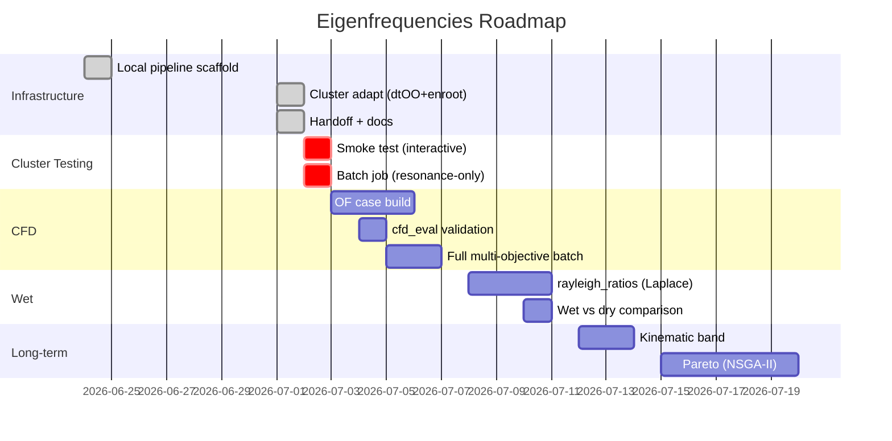

# Eigenfrequencies Dashboard

> [!summary] Project Status
> **Branch:** `main` | **Merged:** `cfd-eigenfreq-multiobjective` (2026-07-02)  
> **Pipeline:** ✅ Scaffolded (local) | **Cluster end-to-end:** 🟡 In Progress  
> **OF CFD case:** 🔴 Not built | **Wet (real Laplace):** 🔴 Stub  
> **Forbidden band:** ✅ Multi-harmonic (Z=18, n=90 rpm) | **Last Commit:** `51464f1` — "feat(optimization): multi-harmonic forbidden band"

---

## 🎯 Active Goals

| Goal | Status | Blocker | Next Step |
|------|--------|---------|-----------|
| Cluster end-to-end test | 🟡 In progress | DE works, need batch job | `sbatch cluster/submit_de.sh` with `CFD_CASE_DIR=""` |
| Multi-harmonic forbidden band | ✅ Done | Implemented | Test with cluster batch |
| OF CFD case build | 🔴 Blocked | Port `CreateMeshes` from de_framework | Extend `dtoo_export.py` to emit OF case dir |
| `cfd_eval` validation | 🔴 Blocked | No real `postProcessing/` output yet | Run `simpleFoam` on cluster, compare column indices |
| `rayleigh_ratios` (wet) | 🟡 Open | Laplace solve needs fluid mesh + wetted-surface tagging | Implement dolfinx fluid-domain solve in `added_mass.py` |
| Mesh units calibration | 🟡 Open | Physical runner dimensions not measured | Run `mesh_prep.py` axis-discovery, compute scale factor |

---

## 📊 Experiment Status

> [!tip] New runs go here. Filterable via Dataview if installed.

| Experiment | Status | Config | Results | Notes |
|-----------|--------|--------|---------|-------|
| Local resonance-only | ✅ Done | `CFD_CASE_DIR=""`, `OPT_MAX_ITER=7` | Penalty 35.99 → 34.30, 7 evals | Modes 3/4/5 in [100,150] Hz |
| Multi-objective scaffold | ✅ Done | `optimize_multi.py` wired | CFD eval ready, OF case dir absent | `objective.py` + `cfd_eval.py` OK |
| Pyro5 DE parallelization | 🟡 In Progress | `server_de.py` + `optimize_de.py` + `start_servers.sh` | — | Replaces ThreadPoolExecutor (deadlock) with rl_framework schema |
| Cluster smoke (interactive) | 🔴 Planned | `salloc -p dev_cpu` | — | **FIRST** — test dtOO + enroot per eval |
| Cluster batch (resonance-only) | 🔴 Planned | `sbatch cluster/submit.sh`, `CFD_CASE_DIR=""` | — | After smoke passes |
| Cluster batch (full CFD+res) | 🔴 Planned | `sbatch cluster/submit.sh` + OF case dir | — | After CFD case build |
| Wet real-Laplace | 🔴 Planned | `added_mass.rayleigh_ratios` | — | After dry baseline stable |

---

## 🔥 Open Blockers

> [!warning] These items block progress

```dataview
TASK FROM [[obsidian_eigenfrequencies]]
WHERE !completed AND priority = "critical"
```

**Manual fallback (if Dataview not installed):**

- [x] Pyro5 DE parallelization test `priority::critical` ✅ 2026-07-02
- [ ] Cluster end-to-end test `priority::critical`
- [ ] `cfd_eval` column validation `priority::critical`
- [ ] OF CFD case build `priority::critical`

---

## ✅ Open Tasks (All)

### Urgent
- [ ] **Cluster end-to-end test** — `sbatch cluster/submit.sh`, monitor `squeue -u $USER`, read `optimize_multi.log`
- [ ] **Validate `cfd_eval.py` column indices** — Confirm against real cluster `postProcessing/` before trusting magnitudes
- [ ] **Build OF CFD case from dtOO state** — Port `createStatesAndMeshes.CreateMeshes` from de_framework

### Important
- [ ] **Mesh units calibration** — dtOO coords scaled ~2.5 → rescale Hz + band
- [ ] **Hub-clamp BC physicality** — Confirm in ParaView, fix if near-zero rigid-body modes
- [ ] **P1 vs P2 convergence** — Test `element_degree=2` on cluster node (more memory)
- [ ] **`rayleigh_ratios` (Laplace solve)** — Replace placeholder ratios, dolfinx fluid mesh
- [ ] **Kinematic blade-passing band** — Auto-derive `Z_guidevanes · n`, update forbidden band

### Optional / Long-term
- [ ] **True Pareto (NSGA-II)** — If scalarization limiting, try multi-objective solver
- [ ] **Unsteady CFD + Helmholtz FSI** — Forced response amplitude, fatigue — out of scope

---

## 📈 Live Metrics

> [!note] Update after each run. Automate via script if possible.

| Metric | Local Resonance-Only | Cluster Batch (pending) | Target |
|--------|----------------------|-------------------------|--------|
| Penalty per eval | 35.99 → 34.30 (7 evals) | — | 0.0 |
| Modes in band | 3 (modes 3/4/5) | — | 0 |
| Runtime / eval | ~minutes (local) | — | < 10 min |
| dtOO build success | 7/7 (local) | — | 100 % |
| Mesh element count | ~80k nodes (P1) | — | stable |
| CFD scalar | N/A (resonance-only) | — | η > 0, Vcav < threshold |
| Wet vs dry shift | ~15 % (placeholder) | — | 20–40 % expected |

---

## 🔗 Quick Links

### Doc
- [[obsidian_eigenfrequencies]] — Main tracker (tasks, experiments, daily log)
- [[HANDOFF]] — Cluster testing tutorial (context-free handoff)
- [[documentation]] — Physics rationale, design decisions
- [[overview]] — Flat ASCII context for AI loads

### Stage 1 — dtOO Geometry
- `dtoo_export.py` — STAGE 1: dtOO → `runner.msh`
- `config.py` `DesignConfig` — Design parameter labels + bounds

### Stage 2 — Modal Solve
- `solver.py` — `RunnerModalSolver` (sparse, config-driven hub clamp)
- `mesh_prep.py` — Load mesh + axis-discovery diagnostic
- `evaluate.py` — Headless frequency evaluation (JSON line)
- `main.py` — Full report + XDMF/VTK/JSON

### Stage 3 — Optimization
- `optimize_multi.py` — Multi-objective host (CFD optional)
- `optimize.py` — Legacy resonance-only host
- `objective.py` — `cfd_scalar` + `resonance_term`
- `optimization.py` — Penalty computation + band report

### CFD / Wet
- `cfd_eval.py` — OpenFOAM `postProcessing` reader
- `added_mass.py` — Wet-mode interface + placeholder + `rayleigh_ratios` stub

### Cluster
- `cluster/submit.sh` — SLURM batch script
- `cluster/apptainer_fenicsx.def` — Container definition
- `cluster/env_notes.md` — Stack interaction notes

### Reference (de_framework)
- de_framework `tistos_files/tistosPyBib.py:GiveFitness` — CFD scalarization
- de_framework `tistos_files/tistosPyBib.py:ReadResults` — PostProcessing reader
- de_framework `createStatesAndMeshes.CreateMeshes` — OF case build

---

## 🗺️ Roadmap



---

## 🐛 Known Bugs — Live Status

| Bug | Severity | Status | Workaround | File |
|-----|----------|--------|------------|------|
| ThreadPoolExecutor deadlock | 🔴 High | 🟡 Fixed | Pyro5 persistent servers | `optimize_de.py` |
| `rayleigh_ratios` NotImplementedError | 🔴 High | 🔴 Open | `placeholder_ratios` ~15 % shift | `added_mass.py` |
| Cluster pipeline not yet run | 🔴 High | 🔴 Open | HANDOFF.md is test script | `cluster/submit.sh` |
| OF case dir empty | 🔴 High | 🔴 Open | CFD degrades to resonance-only | `optimize_multi.py` |
| `cfd_eval` column indices unvalidated | 🟡 Medium | 🔴 Open | Do not trust magnitudes yet | `cfd_eval.py` |
| Mesh units unknown | 🟡 Medium | 🟡 Open | Scale factor TBD | `config.py` / `BCConfig` |
| P2 OOM risk | ⚠️ Low | 🟡 Open | Use P1 on small nodes | `solver.py` |
| No near-zero rigid-body modes locally | ℹ️ Info | 🟢 OK | Clamp passes; ParaView confirm TBD | `solver.py` |

---

## 📋 Daily Standup (Last 3 Days)

> [!example] Short updates — max 3 bullets per day

**2026-07-02**
- ✅ Pyro5 DE parallelization: `server_de.py`, `optimize_de.py`, `start_servers.sh` implemented
- ✅ ThreadPoolExecutor deadlock fixed → persistent Pyro5 worker servers (rl_framework schema)
- 🔄 Pending cluster test: start servers + client, verify .msh production

**2026-07-01**
- ✅ Cluster adaptation: `submit.sh`, `dtoo_export.py`, `optimize.py` updated for native dtOO + enroot
- ✅ HANDOFF.md created for context-free cluster continuation
- ✅ dtOO native + enroot individually verified on cluster

**2026-06-24**
- ✅ Multi-objective scaffold: `optimize_multi.py`, `objective.py`, `cfd_eval.py`, `added_mass.py`
- ✅ Local resonance-only end-to-end: 7 evals, penalty 35.99 → 34.30
- ✅ Dry-vs-wet compare placeholder works (modes 3/4/5 shift out of band)

---

## 🛠️ Tools & Commands

### Interactive cluster smoke test
```bash
salloc -p dev_cpu -n 1 -t 00:30:00
source ~/pe
export LD_LIBRARY_PATH=~/dtOO/install/lib:~/dtOO/install/lib64:$LD_LIBRARY_PATH
cd /pfs/work9/workspace/scratch/st_ac136362-eigenfreq/eigenfrequencies/turbine_runner
CFD_CASE_DIR="" OPT_MAX_ITER=3 python3 optimize_multi.py
```

### Batch job (resonance-only)
```bash
cd /pfs/work9/workspace/scratch/st_ac136362-eigenfreq/eigenfrequencies
sbatch cluster/submit.sh
```

### Monitor
```bash
squeue -u $USER
cat turbine_runner/optimize_multi.log
```

### Axis-discovery diagnostic
```bash
# inside fenicsx container, in turbine_runner/
python3 mesh_prep.py
```

### Cancel job
```bash
scancel <JOBID>
```

---

## 📁 File Structure

```
/home/t1dde/Duty/projects/eigenfrequencies/
├── cluster/
│   ├── apptainer_fenicsx.def    ← Container definition (enroot import)
│   ├── env_notes.md              ← Stack interaction notes
│   ├── run_step_3.2.sh           ← Quick cluster step script
│   └── submit.sh                 ← SLURM batch script
├── docs/
│   └── source/                    ← Sphinx documentation (Makefile)
├── scripts/
│   ├── build_container.sh        ← Build enroot container
│   └── run_container.sh          ← Run enroot container
├── src/
│   ├── geometry/                  ← (empty placeholder)
│   ├── io/                        ← (empty placeholder)
│   ├── optimization/              ← (empty placeholder)
│   └── solver/                    ← (empty placeholder)
├── turbine_runner/
│   ├── added_mass.py             ← Wet-mode interface + placeholder
│   ├── cfd_eval.py               ← OpenFOAM postProcessing reader
│   ├── config.py                 ← All dataclasses (Material, BC, Mesh, Solver, CFD, Objective, WetMode)
│   ├── data/
│   │   ├── runner.msh            ← dtOO-exported mesh
│   │   └── design.json           ← Optimizer design vector
│   ├── dtoo_export.py            ← STAGE 1: dtOO → runner.msh
│   ├── evaluate.py               ← STAGE 2c: headless freq evaluation
│   ├── main.py                   ← STAGE 2: full report + XDMF/JSON
│   ├── mesh_prep.py              ← STAGE 2a: load + axis-discovery
│   ├── objective.py              ← CFD scalar + resonance penalty
│   ├── optimization.py           ← Penalty computation + band report
│   ├── optimize.py               ← STAGE 3 (legacy): resonance-only
│   ├── optimize_multi.py         ← STAGE 3 (new): multi-objective host
│   ├── output/
│   │   ├── optimization.json     ← Legacy optimization history
│   │   ├── optimization_multi.json ← New multi-objective history
│   │   └── modes.*               ← XDMF/VTK/JSON mode shapes
│   ├── README.md                 ← Local usage guide
│   └── solver.py                 ← STAGE 2b: RunnerModalSolver
├── output/                        ← Beam demo outputs (logs, XDMF, PNG)
├── documentation.md              ← Physics rationale, design decisions
├── HANDOFF.md                    ← Cluster testing tutorial
├── obsidian_eigenfrequencies.md  ← Main tracker ← THIS
├── obsidian_dashboard_eigenfrequencies.md ← Dashboard ← THIS
└── overview.md                   ← Flat ASCII context ← THIS
```

---

## 🎯 Definition of Done

> [!success] When is this project "finished"?

- [x] Local resonance-only end-to-end working
- [x] Multi-objective scaffold wired (CFD optional)
- [x] Cluster-adapted (native dtOO + enroot FEniCSx)
- [ ] **Cluster end-to-end batch job succeeds** (resonance-only)
- [ ] **OF CFD case built from dtOO state**
- [ ] **cfd_eval validated against real postProcessing/**
- [ ] **Full multi-objective batch job succeeds** (CFD + resonance)
- [ ] **Wet added-mass implemented** (`rayleigh_ratios` real Laplace)
- [ ] **Mesh units calibrated** (scale factor known)
- [ ] **Kinematic blade-passing band auto-derived**
- [ ] **Code merged to `main`**

---

## 🔄 How to Use This Dashboard

### Without Plugins
- Read as Markdown
- Manually edit checkboxes (`- [ ]` → `- [x]`)
- Manually update tables

### With Obsidian + Dataview
- Auto-filter tasks by priority / completion
- Aggregate experiments dynamically
- Set dashboard as start page

### With Obsidian + Mermaid
- Roadmap Gantt + Pipeline Graph render live
- Visual timeline tracking

---

*Dashboard created: 2026-07-01*
*Last update: 2026-07-02 — Pyro5 DE parallelization implemented*
*Next update: after Pyro5 cluster test / OF case build*
